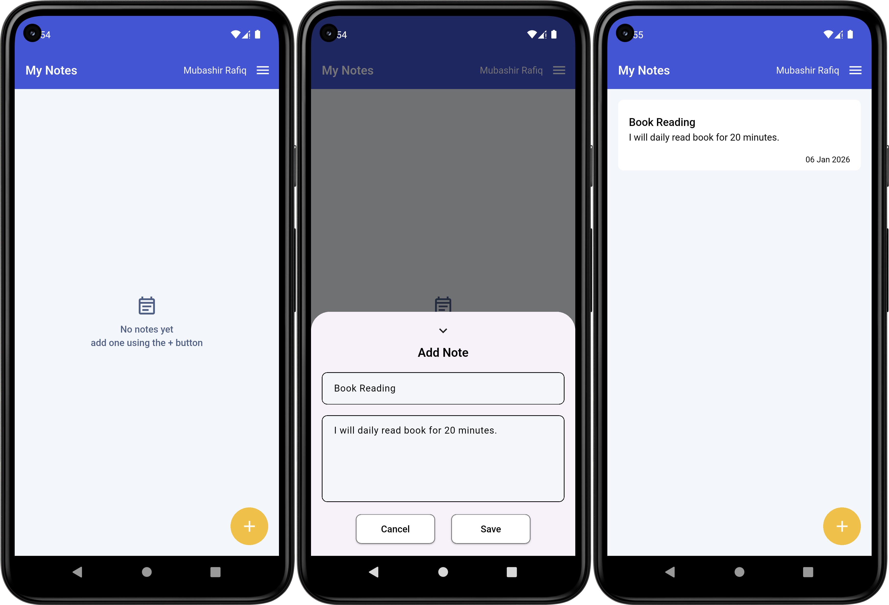
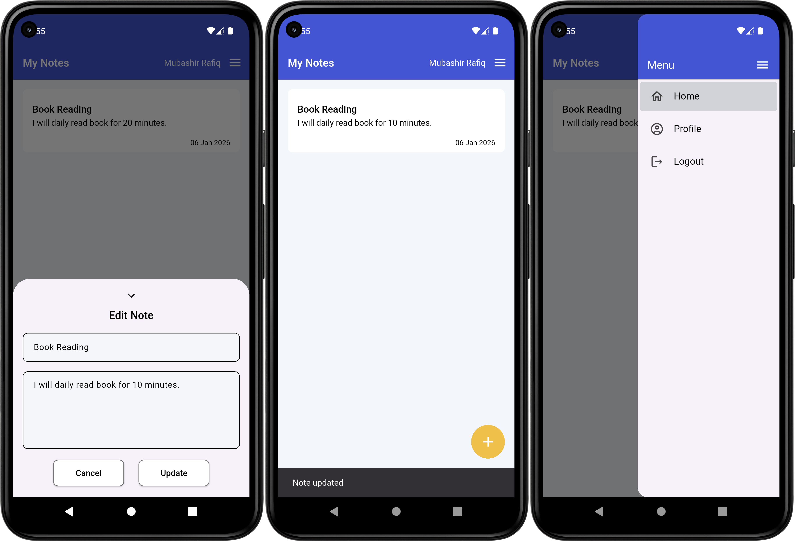
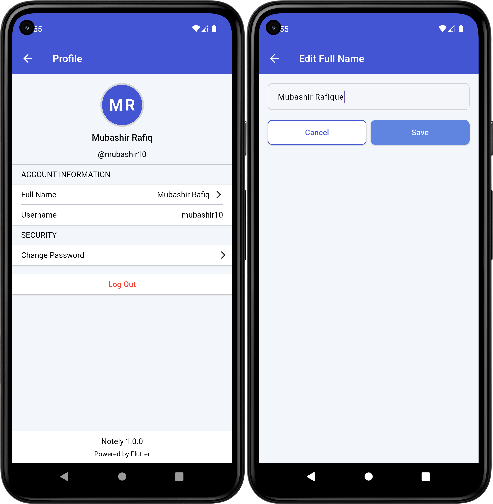

# Notely

Notely is a notes app that I built using Flutter. I made this project to practice building a complete mobile application from scratch. The app allows users to register, log in, and recover their password using local authentication with Sqflite. After logging in, users can create, edit, and delete their notes. All data is stored locally on the device, so the app works fully offline. This project helped me understand app structure, local databases, and how authentication and CRUD operations work together in a real app.

## Content

- [Features](#features)
- [Technology Stack](#technology-stack--tools-used)
- [Project Structure](#project-structure)
- [What I Learned](#what-i-learned)

## Features

### Authentication Screens

Above screenshot shows the authentication flow of the Notely app, which includes Register, Login, and Forgot Password screens. Users can create a new account by providing their full name, username, and password. Existing users can log in using their username and password, with proper validation and error messages. The forgot password screen allows users to reset their password by entering their username and a new password. All authentication data is handled locally using Sqflite, and login state is managed using SharedPreferences. The UI includes loading indicators, password visibility toggle, and user-friendly feedback using snack bars.

### Home & Adding Note 

These Screens shows the main notes flow of the Notely app. The home screen displays a list of notes for the logged-in user, and when there are no notes, a simple empty state message is shown. Users can add a new note using the floating action button, which opens a bottom sheet where they can enter a title and description. After saving, the note appears on the home screen with its title, description, and date. Notes can be tapped to edit or swiped to delete, making note management simple and easy

### Editing Note & App Drawer

These screens show additional features of the Notely app, including editing notes and navigation using the app drawer. Users can tap on a note to open it in edit mode, update the title or description, and save the changes, which are then reflected on the home screen. The app drawer provides quick navigation options such as Home, Profile, and Logout, allowing users to move between screens easily and manage their session

### Profile & Edit Name

These screens show the profile section of the Notely app. The profile screen displays the user’s full name, username, and basic account information, along with options to change the password or log out. Users can also edit their full name, which opens a separate screen where the updated name can be saved. The profile section also shows the app version at the bottom, keeping the user informed about the app details.

## Technology Stack & Tools Used

- **Flutter:** Used for building the complete cross-platform mobile application.
- **Programming Language:** Dart
- **State Management:** setState (Basic Flutter state management)
- **Sqflite:** Local database for storing notes and user data
- **Path & Path Provider:** For managing database paths
- **Shared Preferences:** For session handling and user data
- **Intl:** For date and time formatting
- **Package Info Plus:** To display app version in the profile screen
- **Material Design:** Consistent UI components and styling
- **Flutter Launcher Icons:** For generating app icons
- **IDE:** Android Studio & VS Code

## Project Structure

notely/
│
├── android/                # Android native files
├── ios/                    # iOS native files
├── lib/                    # Main Flutter code
│   ├── core/               # Constants, services, database, DAO
│   │   ├── constants/      # Colors, strings, etc.
│   │   ├── data/           # Database access & shared preferences
│   │   └── service/        # SnackBar, other services
│   ├── presentation/       # UI layer (screens, widgets)
│   │   ├── screens/        # All screens like Home, Profile, EditFullName
│   │   └── widget/         # Reusable widgets (AppText, AppButton, BottomSheet)
│   ├── routes/             # Route names and navigation
│   └── main.dart           # Entry point
├── assets/                 # Images, screenshots, etc.
├── pubspec.yaml            # Flutter dependencies and assets
└── README.md

## What I Learned

While building Notely, I enhanced my skills in the following areas:
- **Flutter Development:** Learned to build a complete cross-platform mobile application using Flutter.
- **Dart Programming:** Applied Dart concepts like null safety, classes, async/await, and collections.
- **State Management:** Managed UI state effectively using setState for dynamic updates.
- **Database Integration:** Implemented local data storage using SQLite with sqflite and managed data via DAO pattern.
- **Shared Preferences:** Stored and retrieved user session and profile information using shared_preferences.
- **Date & Time Handling:** Formatted dates using intl package.
- **Navigation:** Implemented screen navigation and route management in Flutter.
- **Custom Widgets:** Created reusable widgets like AppText, AppButton, AppBottomSheet, and ProfileCard.
- **Bottom Sheets:** Built interactive bottom sheet for adding and editing notes.
- **App Drawer:** Designed a navigation drawer for quick access to Home, Profile, and Logout.
- **Form Validation:** Added validation for note titles, descriptions, and profile updates.
- **App Version & Info:** Fetched app version dynamically using package_info_plus.
- **UI Design:** Practiced building a clean, user-friendly UI with colors, padding, and typography.
- **Debugging & Error Handling:** Handled errors gracefully in async operations and database CRUD functions.

